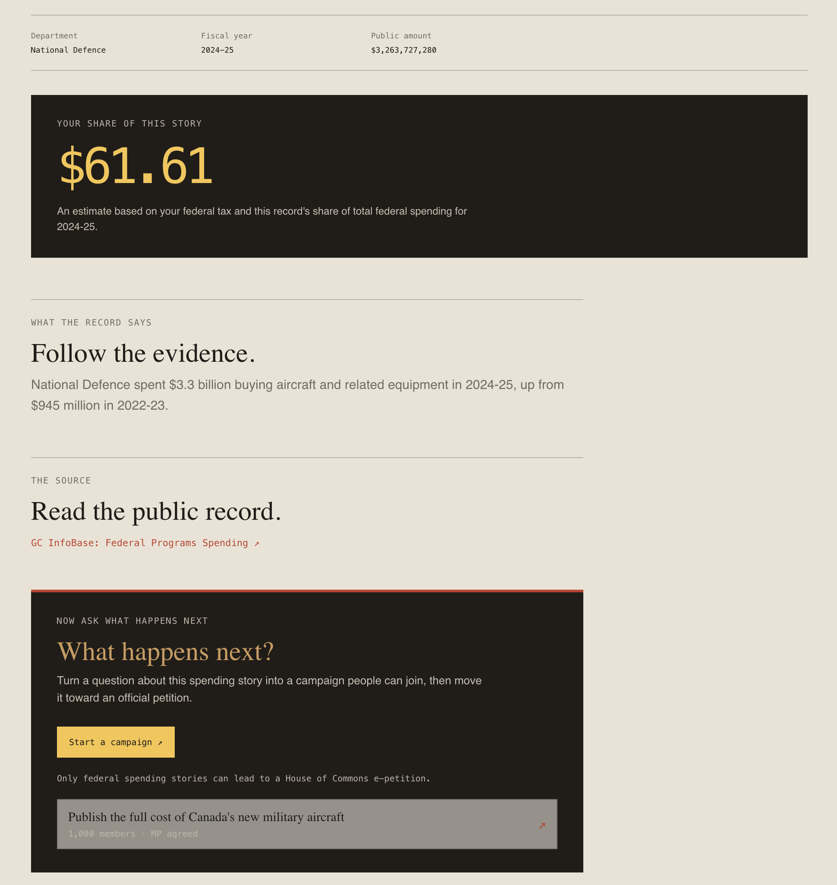
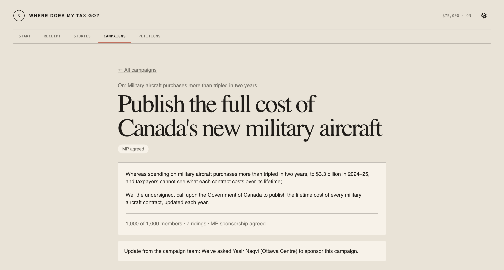
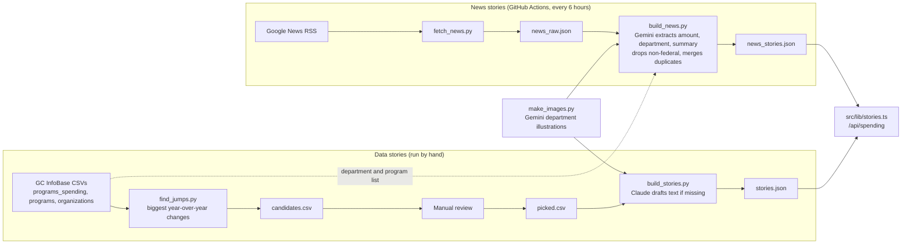

# Where Does My Tax Go

Your federal tax receipt, with a way to act on it.

Live: https://wheredoesmytaxgo.vip

Built at Hack the Hill III by a team of 4.

## What it does

1. Enter your income and province. You see your federal tax broken down by where it went.
2. Browse real federal spending stories, each showing your personal share of the cost.
3. Start or join a campaign on a story.
4. At 1,000 supporters, the team finds an MP to sponsor it, opens the official e-petition on ourcommons.ca, and sends every supporter a link to sign.

### Your share

```
your share = your federal tax × (program cost ÷ total federal spending that year)
```

Example: you pay $9,510 in federal tax, military aircraft cost $3.3B, and total federal spending was about $520B. Your share is $9,510 × (3.3 ÷ 520), about $60.

## Screenshots

| Tax breakdown | Spending stories | Story detail | Campaign |
|---|---|---|---|
|  |  |  |  |

## How it works

### Architecture

The tax math runs in the browser (`src/shared/tax.ts`), so your income never leaves your device. Postgres on Neon, accessed through Drizzle, holds users, campaigns, campaign supporters, official petitions, and the GC InfoBase tables behind the tax breakdown. Stories are not in the database. They live in JSON files written by the pipeline (`pipeline/stories.json` and `pipeline/news_stories.json`) and are read by `src/lib/stories.ts`. Story ids never change, because campaigns point at them.

### Stories pipeline

Data stories are built by hand when new spending data comes out. News stories refresh every 6 hours through GitHub Actions (`.github/workflows/news-pipeline.yml`), which commits the new stories back to the repo. Gemini answers are cached, so each article is only read once.



## Tech stack

**Web app**
- Next.js 16, React 19, TypeScript
- Tailwind CSS 4
- Postgres with Drizzle ORM (`postgres` driver), Drizzle Kit for migrations
- Auth0 (`@auth0/nextjs-auth0`)
- Zod for input validation
- Vitest for tests, PGlite for an in-memory test database

**Stories pipeline (Python)**
- pandas for the GC InfoBase spending data
- Google Gemini (`google-genai`) for reading news articles and for department illustrations
- Anthropic Claude (`anthropic`) as an optional drafter for data story text
- Pydantic for structured LLM output
- Pillow for images

## Team

| Person | Area |
|---|---|
| Great Nnaji | Stories pipeline (GC InfoBase spending jumps, Google News ingestion, LLM story generation, dedupe, 6-hourly GitHub Actions refresh) and campaigns (start and join) |
| Izuchukwu Amadi | UI: all 6 screens |
| Raphaël | Tax calculator, tax breakdown, spending API, official petitions |
| Muktar Akinbile | Auth0 login, MP lookup, draft flow, admin page, deploy, demo |
